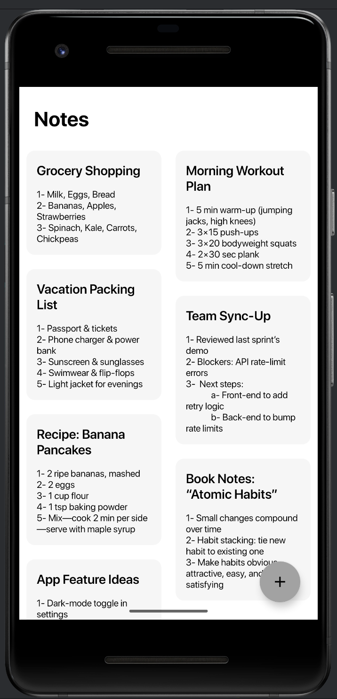
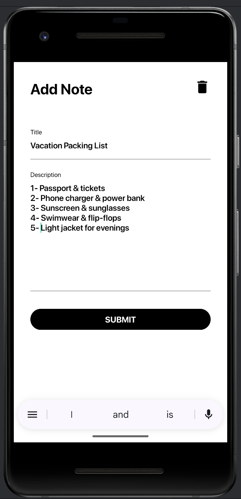
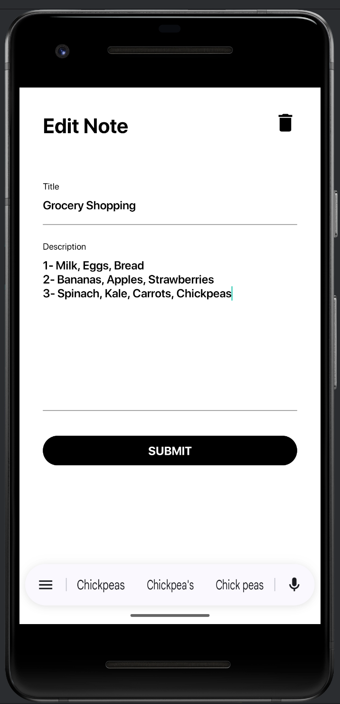

# NotesApp

NotesApp is a simple, clean Android application written in Kotlin that lets you create, read, update, and delete notes via a RESTful backend. It showcases a modern MVVM architecture, Hilt for dependency injection, Retrofit with Gson for networking, and Kotlin Coroutines for asynchronous operations. The UI displays all notes in a `RecyclerView` on launch (fetched from `/api/notes`), allows adding a new note via a floating action button (enter title & description), editing an existing note by tapping it, and deleting by swiping left or right. Loading, success, and error states are surfaced to the user through a sealed `NetworkResult` wrapper and LiveData observers in the Fragments.

## Features
- **CRUD operations** against a `/api/notes` REST API
- **MVVM architecture**: Fragments → ViewModels → Repository → Retrofit API
- **Dependency Injection** with Hilt
- **Networking** with Retrofit 2 + Gson converter
- **Concurrency** using Kotlin Coroutines
- **UI state management** via LiveData and Data Binding
- **Loading, Success & Error** states handled by `NetworkResult`
- **Swipe-to-delete** in the notes list and long-press actions

## Architecture & Tech Stack
- **Language:** Kotlin
- **Architecture:** MVVM (Model–View–ViewModel)
- **Dependency Injection:** Hilt
- **Networking:** Retrofit 2 + Gson
- **Asynchronous:** Kotlin Coroutines
- **UI:** AndroidX, Material Components, Data Binding Library
- **State:** LiveData, sealed `NetworkResult` wrapper
- **Logging:** Android `Log` for network errors

## Project Structure
NotesApp/
├── app/
│ ├── src/main/
│ │ ├── java/com/example/notesapp/
│ │ │ ├── api/ # Retrofit interfaces (NotesAPI)
│ │ │ ├── model/ # Data classes: NotesRequest, NotesResponse
│ │ │ ├── repository/ # NotesRepository + NetworkResult handling
│ │ │ ├── ui/ # Fragments & Adapters: NotesListFragment, NoteFragment
│ │ │ ├── viewmodel/ # ViewModels exposing LiveData
│ │ │ └── di/ # Hilt modules (provides Retrofit, API, Repository)
│ │ └── res/
│ │ ├── layout/ # XML layouts
│ │ └── values/ # strings.xml, styles.xml, themes.xml
│ └── build.gradle.kts
├── build.gradle.kts
├── settings.gradle.kts
└── README.md # ← this document

## 📸 Screenshots

<!-- Replace with actual screenshots -->
  

